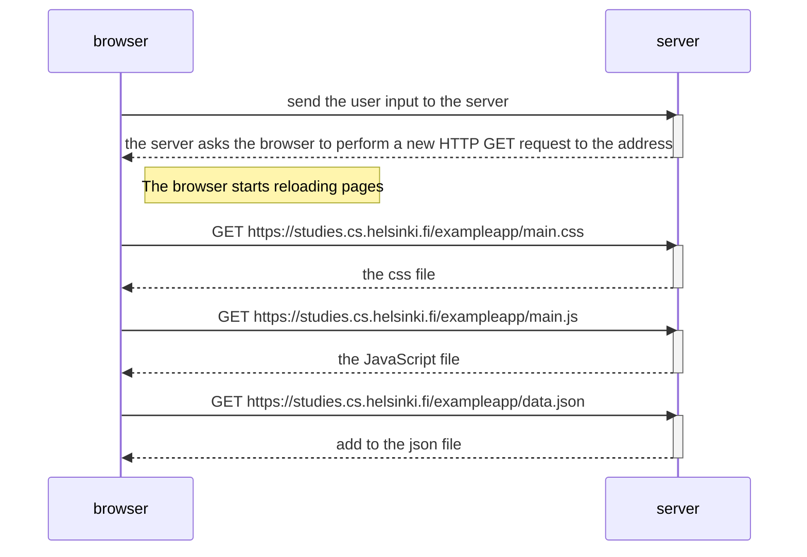

```mermaid
sequenceDiagram
    participant browser
    participant server

    browser->>server: send the user input to the server
    activate server
    server-->>browser: the server asks the browser to perform a new HTTP GET request to the address 
    deactivate server
    Note right of browser: The browser starts reloading pages

    browser->>server: GET https://studies.cs.helsinki.fi/exampleapp/main.css
    activate server
    server-->>browser: the css file
    deactivate server

    browser->>server: GET https://studies.cs.helsinki.fi/exampleapp/main.js
    activate server
    server-->>browser: the JavaScript file
    deactivate server

    browser->>server: GET https://studies.cs.helsinki.fi/exampleapp/data.json
    activate server
    server-->>browser: add to the json file 
    deactivate server

   
```
