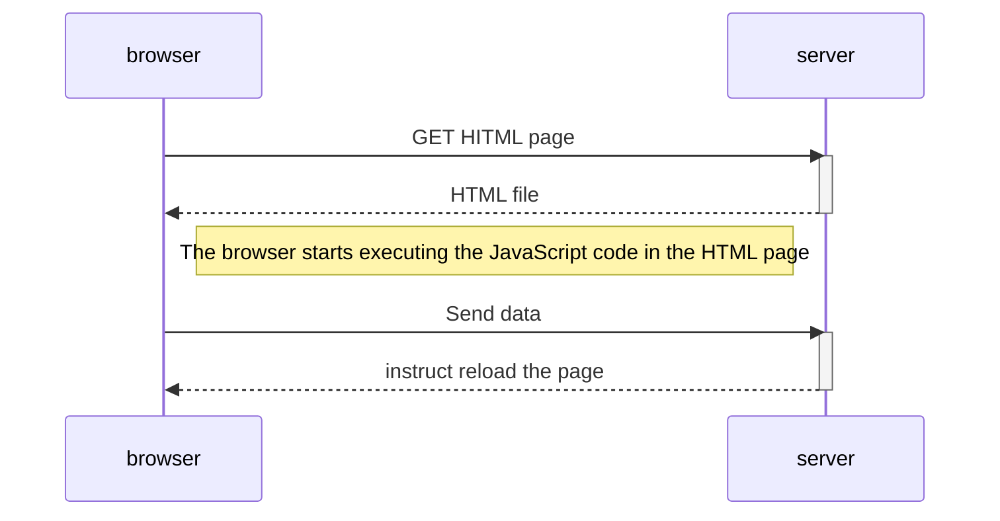

```mermaid
sequenceDiagram
    participant browser
    participant server

    browser->>server: GET HITML page
    activate server
    server-->>browser: HTML file
    deactivate server

    Note right of browser: The browser starts executing the JavaScript code in the HTML page

    browser->>server: Send data  
    activate server
    server-->>browser: instruct reload the page 
    deactivate server

```
